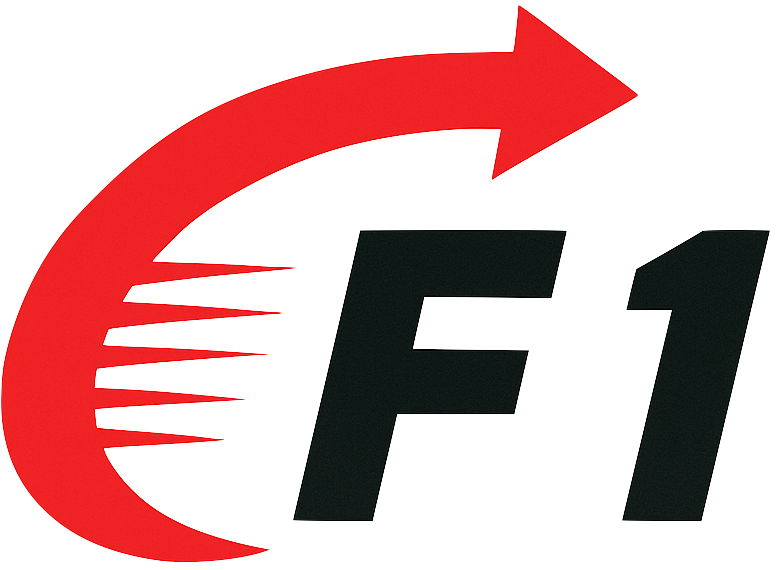

<div align="center">

# : A Vision Language Action Model Bridging<br>Understanding and Generation to Actions

</div>

<div align="center">

[](https://arxiv.org/abs/xxxx.xxxxx)
[](https://aopolin-lv.github.io/F1-VLA)
[](https://www.youtube.com/watch?v=wz-fOJU3FEM)
[](LICENSE)

</div>

---


We introduce $\mathcal{F}_1$, a novel paradigm by integrating **visual foresight generation** into the decision-making pipeline. Our model employs a Mixture-of-Transformer architecture with dedicated modules for perception, foresight generation, and control, thereby bridging understanding, generation, and actions through **predictive inverse dynamics modeling**.

<div align="center">
  <video src="https://github.com/user-attachments/assets/7d24ac5f-e8fa-4609-8731-2f36b64a9005"
         controls autoplay muted playsinline loop width="720"></video>
  
  <p><em>🏁 Best viewed with sound on</em></p>
</div>

## 🚀 Key Innovations

- **🧠 Predictive Inverse Dynamics**: Visual foresight generation for planning-based control
- **🏗️ Mixture-of-Transformer**: Three specialized experts (Understanding, Generation, Action)
- **📈 Three-Stage Training**: Progressive alignment, pretraining, and adaptation


## 🤖 Real-World Robot Experiments

### **Multi-task Manipulation**
<div align="center">
    <video src="https://github.com/user-attachments/assets/047ebb04-6dcf-4555-abbc-ecdec6f47527"
         controls autoplay muted playsinline loop width="720"></video>
  <p><em>9 diverse manipulation tasks including pick-and-place, handover, and complex object manipulation</em></p>
</div>

### **Rapid Adaptation**
<div align="center">
    <video src="https://github.com/user-attachments/assets/61eb62fc-5d2f-412d-9b23-9a7f97d5c37b"
         controls autoplay muted playsinline loop width="720"></video>
  <p><em>Sweep and sort tasks demonstrating rapid embodiment adaptation capabilities</em></p>
</div>

### **Long-horizon Planning**
<div align="center">
      <video src="https://github.com/user-attachments/assets/93a5bce0-7a90-4a6c-9447-7d0885778775"
         controls autoplay muted playsinline loop width="500"></video>
  <p><em>10-step sequential task over 2 minutes, showcasing long-term planning and execution</em></p>
</div>

### **Dynamic Environment**
<div align="center">
    <video src="https://github.com/user-attachments/assets/89a804a0-7a4a-4df0-a284-4a072a8e720d"
         controls autoplay muted playsinline loop width="500"></video>
  <p><em>Moving conveyor belt manipulation, demonstrating dynamic scene handling capabilities</em></p>
</div>

### **Performance Summary**

| Task | Platform | $\mathcal{F}_1$ | $\pi_0$ | Improvement |
|:--------:|:------------:|:------------------:|:------------:|:---------------:|
| Multi-task | Genie-1 | 82.2% | 65.2% | +17.0% |
| Adaptation | Franka | 66.7% | 53.3% | +13.4% |
| Long-horizon | ARX LIFT II | 40.0% | 0.0% | +40.0% |
| Dynamic Env | ARX LIFT II | 66.7% | 33.3% | +33.4% |


## 🚀 Quick Start

### **Prerequisites**
- Python ≥ 3.10
- torch ≥ 2.6.0
- CUDA ≥ 12.4

### **Installation**
```bash
# Clone repository
git clone https://github.com/aopolin-lv/F1-VLA.git
export VLA_HOME=$(pwd)
cd F1-VLA/f1_vla

# Create environment
conda create -f f1_vla python==3.10
conda activate f1_vla

# Install dependencies
pip install torch==2.6.0 torchvision==0.21.0 torchaudio==2.6.0 torchcodec==0.2.1 --index-url https://download.pytorch.org/whl/cu124
pip install -r requirements.txt

# install f1_vla
pip install -e .

pip install numpy==1.26.4
```

For optimal performance and compatibility, we highly recommend using [FFmpeg](https://ffmpeg.org/) alongside [TorchCodec](https://github.com/pytorch/torchcodec). 

- FFmpeg is an industry-standard multimedia framework that provides robust, all-purpose video and audio processing.
- TorchCodec is a library specifically designed for deep learning workflows in PyTorch, offering highly optimized video I/O. 
 
By using these two tools, the time of loading the video dataset is greatly accelerated.

### **Download Pretrained Datasets and Models**

|**Name**| **link**|
|:--|:--|
|LIBERO_SPATIAL_NO_NOOPS_PATH|[IPEC-COMMUNITY/libero_spatial_no_noops_1.0.0_lerobot](https://huggingface.co/datasets/IPEC-COMMUNITY/libero_spatial_no_noops_1.0.0_lerobot)|
|STAGE2_CKPT_PATH||
|LEROBOT_PI0_PATH|[lerobot/pi0](https://huggingface.co/lerobot/pi0)|
|PALIGEMMA_PATH|[google/paligemma-3b-pt-224](https://huggingface.co/google/paligemma-3b-pt-224)|
|VAE_PATH|[var_d16.pth](https://huggingface.co/FoundationVision/var/resolve/main/var_d16.pth)|

### **Basic Usage**
```shell
f1_vla
├── config
│   ├── debug_test.yaml
│   └── f1_config.json
├── requirements.txt
├── setup.py
├── src
│   ├── configs
│   ├── models
│   ├── policies
│   ├── processors
│   └── utils
└── train_hf.py
```

#### Finetune
```shell
# 1. edit config file
vim f1_vla/config/debug_test.yaml

# 2. run the program
cd $(VLA_HOME)
python train_hf.py --config-file f1_vla/config/debug_test.yaml
```


## 📚 Citation

If you use this work in your research, please cite our paper:

```bibtex
@article{f1_vla_2025,
  title={F1: A Vision Language Action Model Bridging Understanding and Generation to Actions},
  author={Qi Lv and Weijie Kong and Hao Li and Jia Zeng and Zherui Qiu and Delin Qu and Haoming Song and Qizhi Chen and Xiang Deng and Jiangmiao Pang},
  year={2025},
  url={arxivx}
}
```

## 📄 License

This project is licensed under the MIT License.

## 🙏 Acknowledgments

- [Lerobot](https://github.com/huggingface/lerobot)
- [Any4lerobot](https://github.com/Tavish9/any4lerobot/)
- [VAR](https://github.com/FoundationVision/VAR)
